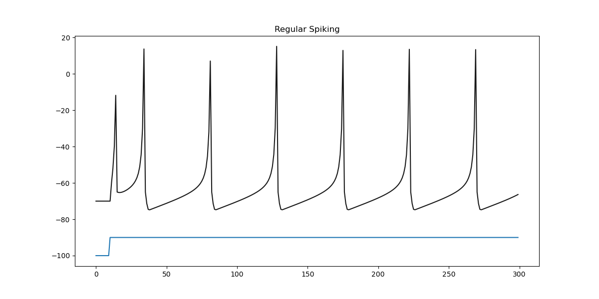
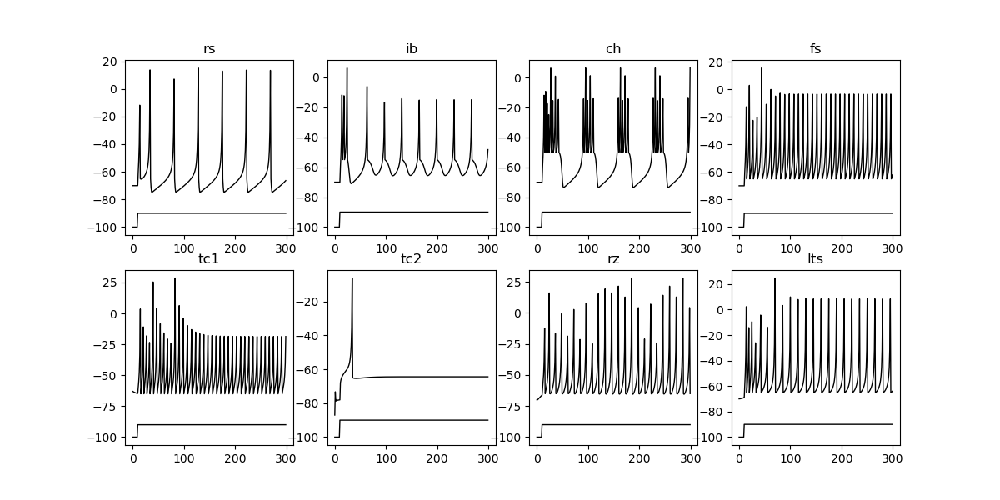

### 🧠 Izhikevich Spiking Model Neurons: A Jupyter Notebook README

This repository contains a Jupyter notebook that explores the dynamics of a single neuron using the **Izhikevich Spiking Neuron Model**. This simplified yet powerful model is widely used in computational neuroscience to simulate the behavior of different types of neurons, capturing key firing patterns with a small set of parameters.

---

### 📚 The Izhikevich Model

The model is defined by two ordinary differential equations, which describe the evolution of the neuron's membrane potential ($$v$$) and a recovery variable ($$u$$):

$$v' = 0.04v^2 + 5v + 140 - u + I$$
$$u' = a(bv - u)$$

A key feature of the model is its reset mechanism:

$$\text{if } v \ge 30 \text{ mV then } v \leftarrow c \text{, } u \leftarrow u + d$$

The parameters $$a, b, c, \text{ and } d$$ are crucial as they determine the specific firing behavior of the neuron. This notebook demonstrates how changing these parameters can simulate various neuron types, such as regular spiking (RS), intrinsic bursting (IB), and fast spiking (FS) neurons.

---

### 💻 Code Implementation

The simulation is implemented in Python using the `numpy` library for numerical operations and `matplotlib` for plotting.

The `response` function is the core of the simulation, implementing the Izhikevich equations and the reset condition.

```python
import numpy as np
import matplotlib.pyplot as plt
import seaborn

def response(v, u, i, a, b, c, d):
    v_ = 0.04*v**2 + 5*v + 140 - u + i
    u_ = a*(b*v - u)

    if v+v_ >= 30:
        v = c
        u = u+d
    else:
        v = v + v_
        u = u + u_
    # print(v_, u_, params)
    return u, v


params = {
    'rs': np.array([0.02,0.2,-65, 8]),
    'ib' : np.array([0.02,0.2,-55, 4]),
    'ch' : np.array([0.02, 0.2, -50, 2]),
    'fs' : np.array([0.1, 0.2, -65, 2]),
    'tc1': np.array([0.02,0.25,-65, 0.05]),
    'tc2' : np.array([0.02,0.25,-65, 0.05]),
    'rz' : np.array([0.1, 0.25, -65, 2]),
    'lts' : np.array([0.02, 0.25, -65, 2])}

T = np.arange(0,300,1)
u = np.zeros((len(T),len(params)))
v = np.zeros((len(T),len(params)))
I = np.zeros(len(T))
I[10:] = 10
u[0,:] = -14
v[0,:] = -70

#special case thalamo-cortical
v[0,4] = -63
u[0,4] = -16
v[0,5] = -87
u[0,5] = -16
```
### 📊 Results

The simulation generates plots to visualize the membrane potential over time.

#### Regular Spiking Neuron

The first plot illustrates the characteristic behavior of a **regular spiking** neuron, showing a consistent pattern of spikes in response to a constant input current.


#### All Neuron Types

The notebook also generates a comparative plot, showcasing the distinct firing patterns of all the simulated neuron types side-by-side. This visual comparison highlights the model's ability to replicate diverse neural behaviors by simply adjusting a few parameters.


The output of the notebook includes the final values of the membrane potential and recovery variable for the `tc1` and `tc2` neurons, confirming their end states: `-18.618891266945894 -64.41391109256088 -13.521178002359932 -16.103477773160503`.

## References

- Izhikevich, E. M. (2003).  
  *Simple model of spiking neurons*.  
  IEEE Transactions on Neural Networks, **14**(6), 1569–1572.  
  [https://www.izhikevich.org/publications/spikes.pdf](https://www.izhikevich.org/publications/spikes.pdf)

